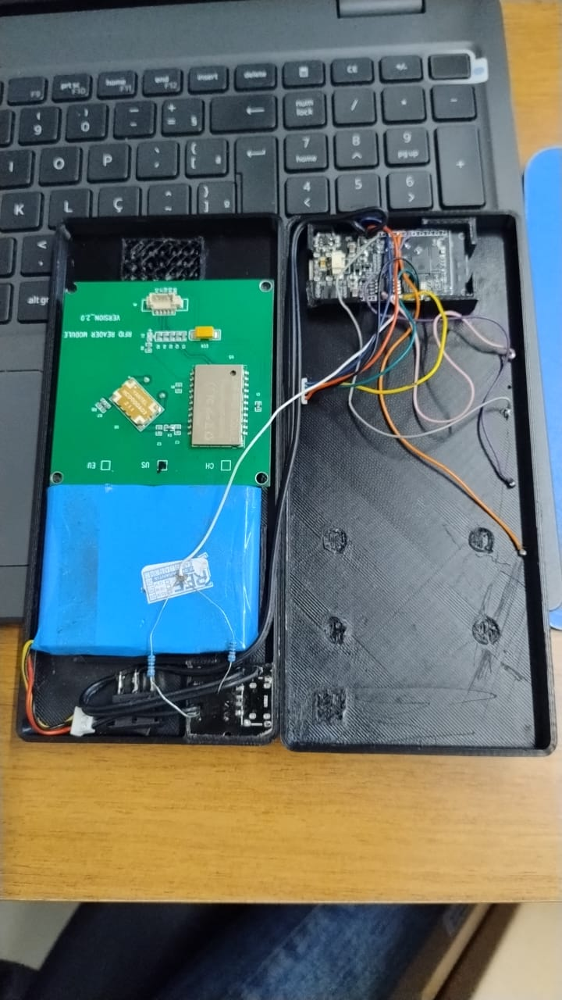
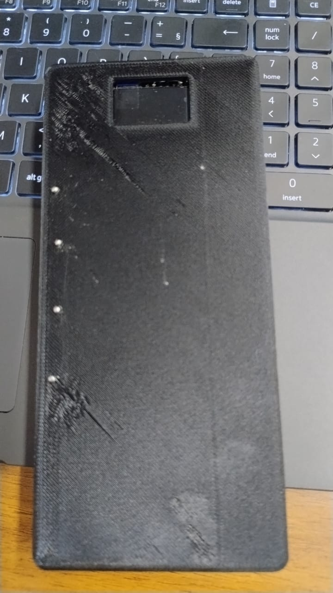
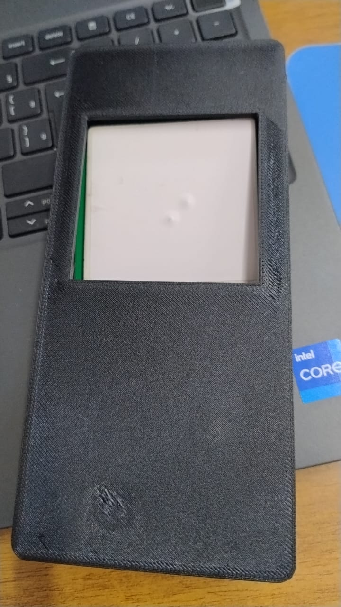
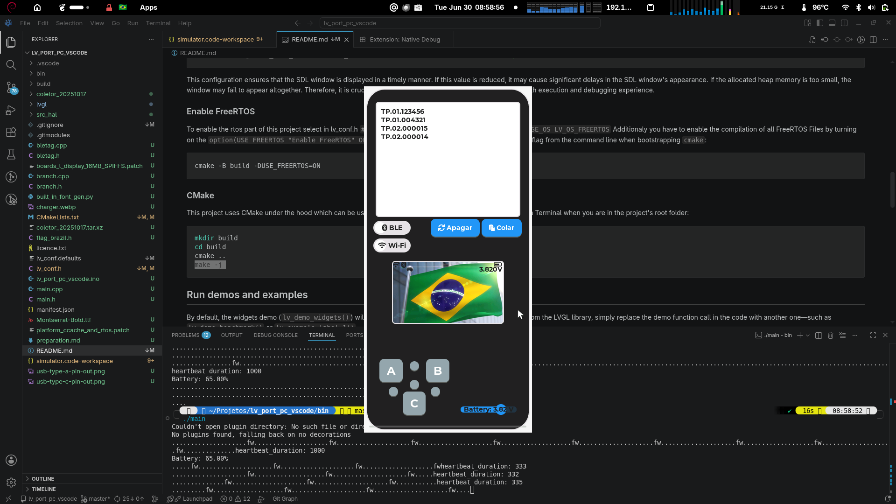

# ESP32 with RFID Antenna and BLE Keyboard

This repository contains a portable RFID asset scanner built with an ESP32. It reads RFID cards/tags and wirelessly transmits the data as a Bluetooth Low Energy (BLE) keyboard input directly into spreadsheet applications.

## 🎥 Video Demonstration (prototype)

[Video Demonstration (prototype)](demo.mp4)

  <video src="demo.mp4?raw=true" controls width="100%" style="max-width: 400px; border-radius: 10px; box-shadow: 0 4px 8px rgba(0,0,0,0.1);">
    Your browser does not support the video tag.
  </video>

---

## 📸 Hardware Gallery (MVP)

Below is a breakdown of the 3D-printed enclosure assembly and internal component layout.

<table width="100%">
  <tr>
    <td align="center" width="33.33%" style="border: none; vertical-align: top;">
      
       
      <b>Internal Wiring</b> ESP32, RFID Reader v2.0 & LiPo Battery
    </td>
    <td align="center" width="33.33%" style="border: none; vertical-align: top;">
      
       
      <b>Enclosure Front</b> OLED Display Cutout
    </td>
    <td align="center" width="33.33%" style="border: none; vertical-align: top;">
      
       
      <b>Enclosure Back</b> RFID Antenna Panel View
    </td>
  </tr>
</table>

---

## 📱 ↦ 🖥️ UI Simulator (SDL + LVGL)

To accelerate interface development, the device UI was prototyped and tested on a desktop simulator using the **LVGL** graphics library and **SDL** framework.

  

